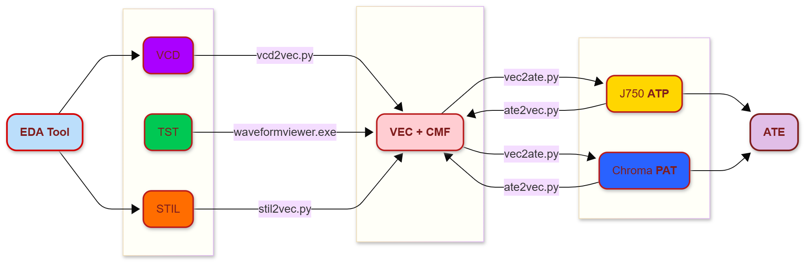
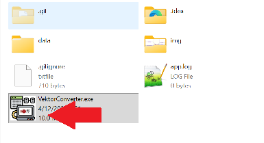
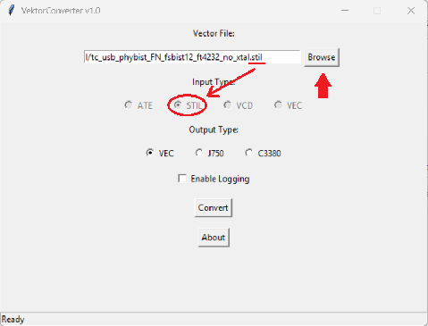
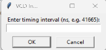
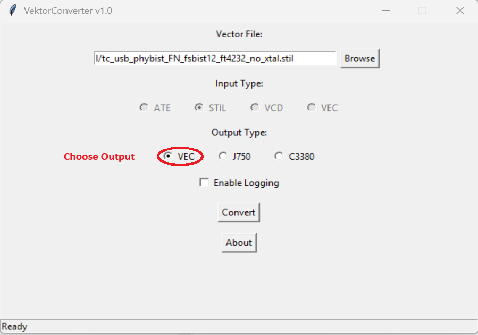
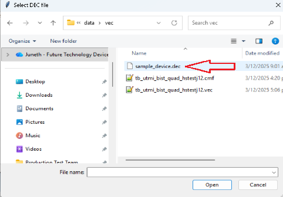
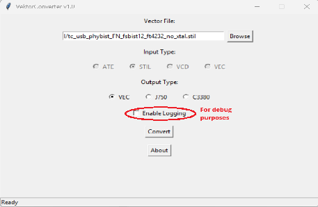
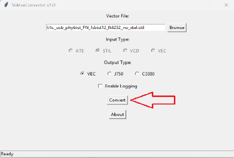

# VektorConverter 

VektorConverter is a desktop GUI tool designed to convert various EDA vector formats into ATE‑ready pattern files for **Teradyne J750** and **Chroma C3380** testers.

This tool simplifies cross‑platform pattern generation by unifying ATP, STIL, VCD, and generic VEC flows into a single conversion interface.

It is also capable of converting patterns from J750 to Chroma C3380 and vice versa.

---

## Download

You can download the latest executable here:

[Download VektorConverter.exe](https://github.com/juneth098/VektorConverter/releases)


---

## 🗂️ Conversion Process
The diagram below shows the flow from EDA inputs to ATE-ready outputs:  


1. IC Design provides patterns in `.stil` or `.vcd` formats.  
2. `.tst` are legacy compressed patterns.  
3. `.vec` and `.cmf` files are generated.  
4. Convert to ATE patterns (`.atp`, `.pat`).  
5. `.atp` and `.pat` can be converted back and forth.


---
## 🚀 Features

### **✔ Multi‑format Input Support**
- **ATE**: `.atp`, `.pat`
- **STIL**: `.stil`
- **VCD**: `.vcd`
- **VEC**: `.vec`

### **✔ ATE‑Ready Output Formats**
- **J750** pattern (`.atp`)
- **Chroma C3380** pattern (`.pat`)
- **Generic VEC** (`.vec`)

### **✔ Auto‑Detection**
The tool automatically detects input type based on file extension and locks radio‑button selection to prevent mismatches.

### **✔ DEC File Support (Chroma)**
For C3380 conversion, the GUI will automatically prompt for a required **DEC** file.

### **✔ VCD Interval Handling**
When converting `.vcd`, tool dynamically asks for timing interval (ns).

### **✔ Built‑in Logging**
- Optional file logging
- Status bar logs also captured if logging enabled

### **✔ Clean GUI Implementation**
- Dialog‑driven input selection
- Auto‑enabled/disabled controls
- Status notifications

## ⚠️ Limitations

- Supports **single waveform timing set only**
- **No pattern groups** support
- Does **not** process advanced commands (e.g., `RPT`, `IMATCH`, `LOOP`)


---

## 📁 Project Structure
```
VektorConverter/
│
├── data/
│   ├── ate/                # Sample .atp / .pat files
│   ├── stil/               # Sample .stil files
│   ├── vcd/                # Sample .vcd files
│   └── vec/                # Sample .vec and .cmf files
│
├── scripts/
│   ├── ate2vec.py          # format-specific converters
│   ├── gui.py              # Main Tkinter GUI
│   ├── logger.py           # Console + file logger
│   ├── main.py             # Conversion engine
│   ├── metadata.py         # Version & author info
│   ├── stil2vec.py         # format-specific converters
│   ├── vcd2vec.py          # format-specific convertersr
│   └── vec2ate.py          # format-specific converters
│
└── README.md
   
```

---

## 🖥️ How to Use (GUI)

### 1. **Launch the application**
```
Run VektorConverter.exe
```


### 2. **Select input file**
Click **Browse**, then choose:
- `.atp` / `.pat`
- `.stil`
- `.vcd`
- `.vec`



The tool auto‑detects the format and locks the input‑type selection.

### 2.a. **If VCD is selected**
Enter timing interval in nanoseconds.



### 3. **Choose Output Format**
- VEC
- J750
- C3380

(Depending on input, some outputs may be disabled.)



### 3.a. **If C3380 is selected**
A prompt will ask for a **DEC** file.




### (optional) 4. **Enable Log**
It will generate `app.log` for debug purpose.



### 5. **Click Convert**
Converted output is generated into the same directory as the input (same input filename).



---

## 🔧 Conversion Rules
### Prevents invalid conversions
- ATP → ATP (J750) **not allowed** (prevents same‑to‑same output)
- PAT → PAT (C3380) **not allowed**

### VEC Output
Disabled when original input is already VEC.

---

## 🧩 Dependencies
- Python 3.8+
- Tkinter (built‑in)
- Standard library modules

No external pip dependencies unless additional converter plugins are added.

---

## 📜 License
```
Copyright (c) 2025 Juneth Viktor Ellon Moreno
All rights reserved.
```
This project is closed‑source unless otherwise declared.

---

## 📝 Author
**Juneth Viktor Ellon Moreno**

GitHub repository:
https://github.com/juneth098/VektorConverter

---

## 💬 Support
For issues, enhancements, or pattern‑format questions, please contact the author or open an issue in the repository.

